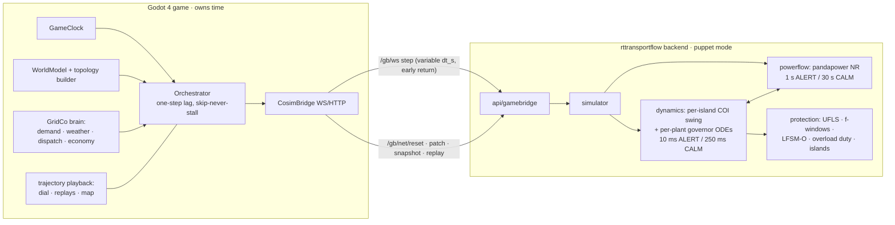

# ROADMAP.md — rttransportflow build order

## Vision

A Europe-scale transmission game where the player decarbonizes a continent
without degrading frequency stability — every RoCoF, nadir, and cascade
computed by a real per-island swing equation over the fleet the player built.
Backend: Python/FastAPI, pandapower AC PF + own NumPy dynamics layer. Game:
Godot 4. One monorepo. Full spec: [SPEC.md](SPEC.md) and the documents it
indexes — **read SPEC §0 before writing any code.**

## System diagram

## Rules (binding)

- **Do not start a phase before the previous phase's acceptance criteria
  pass.** Every phase ends with its smokes/tests green in CI and a CLAUDE.md
  log entry (Built / Tests / Acceptance evidence / Discoveries /
  Deviations-deliberate).
- Every physics addition needs an analytic or known-answer test first —
  no test, no feature.
- Every pandapower claim is runtime-verified (`scripts/validate_core.py`)
  before its spec section is trusted, then pinned.
- Lean solo agent work — state the scale and ask before any multi-agent
  fan-out.

## Performance budget (targets; re-measured and pinned at P0 in ADR-004)

| Item | Target |
|---|---|
| Reset + warmup | ≤ 5 s |
| Dyn tick, 150 devices | ≤ 15 µs |
| pandapower NR, 300 buses, warm | ≤ 8 ms |
| 900 sim-s CALM (speed 900×) | < 1 s wall |
| ALERT at speed 10 | < 100 ms wall per wall-second |
| Step-result payload | ≤ 64 kB |

---

## P0 — Scaffold, feasibility spikes, ADRs, CI

*Goal:* a green, empty-but-running family-shaped repo with the load-bearing
feasibility numbers measured.
*Scope:* repo layout (SPEC §3); pyproject + config (`RTTRANSPORTFLOW_`, port
8003); `/health`; RealtimeEngine tick loop on a null simulator; launchers;
Dockerfile/compose skeleton; CI (pytest-gated). Spikes with measured results
into ADRs: (a) pandapower AC PF on a 20-bus 380 kV net — solve ms, warm-start
behavior, `enforce_q_lims`; (b) vectorized NumPy tick loop for 150 devices —
µs/tick at dt 10 ms and 250 ms (decides whether numba is needed; declare numba
explicitly regardless). ADR-001 engine split (PF + swing), ADR-002 monorepo,
ADR-003 MW wire units, ADR-004 measured budgets. `validate_core.py` started.
*Done when:* CI green; `curl :8003/health` returns identity; ADR-004 contains
real measured numbers.
*Proof:* pytest smoke suite + ADR tables.

## P1 — Steady-state PF on an authored Europe mini-grid, standalone + Grafana

*Goal:* the backend is a working rtpowerflow-class teaching tool on a 10-bus
Europe grid.
*Scope:* full data contract (SPEC §4.1) with models/data_loader/
cross-validation; author `data/grids/europe_mini/` (10 buses ≈ 8 countries,
380 kV corridors, mixed fleet, daily load profiles); network_builder
(build-once + element-index maps); simulator with retry ladder + `_r()`;
StepResult v0 (no freq block yet); REST+WS surface; accelerated ticks;
recorder/exporter; visualization stack (collector → InfluxDB 8089 → Grafana
3003; provisioned dashboard: flows, loadings, voltages).
*Done when:* `docker compose up` shows europe_mini flowing in Grafana;
known-answer test pins exact PF numbers for the bundle; API surface pinned;
forced divergence → `converged:false` frame, loop alive, never 500.
*Proof:* `test_known_answer.py`, `test_api_surface.py`,
`test_nonconvergence.py`, compose smoke script.

## P2 — Frequency dynamics engine + analytic validation

*Goal:* the system has a frequency, and it is *right*.
*Scope:* implement PHYSICS §1–§2 core: `dynamics/` package (fleet
struct-of-arrays, per-island COI swing with semi-implicit update, exact-
exponential lag integrator, ALERT/CALM mode controller, event queue, tick
order), generic governor/turbine placeholder for all kinds, PF↔dynamics
ledger coupling (§2.5), variable-`dt_s` `step()` with early return, trajectory
buffers + telemetry rings + rolling engine-snapshot ring, `snapshot.py`; freq
panel in Grafana; mirror the docs/PHYSICS.md §2.1 honesty section into README.
*Done when (PHYSICS §6 tests 1–2, 5–9, 12):* analytic fixture RoCoF within
0.5 % and QSS Δf within 0.1 % of closed forms; nadir/inertia sweep strictly
monotone; exact-lag pin; slicing identity bit-exact across a mode transition;
snapshot bit-replay; early-return semantics; PF sanity vs pinned pandapower
cases; energy balance ≤ 1 % every step.
*Proof:* `test_dynamics_analytic.py`, `test_exact_lag_pin`,
`test_slicing_identity`, `test_snapshot_replay`, `test_early_return`,
`test_pf_sanity`, `test_energy_balance`.

## P3 — Distinct plant unit models, trips, storage device dynamics

*Goal:* each plant kind *feels* different — the pedagogical heart.
*Scope:* per-kind models per PARAMETERS §1 wired through
`data/catalogs/plant_types.json` (every constant with a rationale string):
steam-reheat (nuclear/coal/lignite), CCGT gas-path + steam tail, OCGT GAST,
hydro transient-droop + non-minimum-phase column, battery GFL FFR + SoC,
grid-forming virtual inertia, wind/PV availability-following + LFSM-O,
electrolyzer as sheddable load; start/stop sequences with lead times; per-kind
f-window self-protection; fuel/efficiency meters (economics consumes them in
P6).
*Done when:* `test_units_comparative` (PHYSICS §6.14) pins the three-fleet
comparison; `test_battery_ffr` and `test_hydro_nonminimum_phase` green;
commanding a cold nuclear start delivers no power for the modeled hours;
PARAMETERS §2.3 worked-example table reproduced ±2 % as a known-answer test
(exogenous H = 0 infeed loss, per its setup note).
*Proof:* `test_units_comparative.py` + per-unit step-response pins +
known-answer §2.3.

## P4 — Gamebridge v2 + contract suite + minimal Godot shell with live frequency

*Goal:* the game exists, owns time, and the player watches Europe's real
frequency move.
*Scope:* implement `docs/contract/v2.md` in `api/gamebridge.py`
(version/reset/patch/step/ws/result/snapshot/telemetry-ring;
`RTTRANSPORTFLOW_EXTERNAL_CLOCK`); **freeze the contract → `v2.md` +
schemas**; contract golden suite on port 8032; Godot project with autoloads
ported from infrastruct (GameClock, SidecarManager, CosimBridge with v2
`EXPECTED_CONTRACT`, Orchestrator near-verbatim + variable-`dt_s` stepping
recipe and `dt_done_s` clock advance); **stub boundary provider** (game-side
replay of the europe_mini daily profiles + constant availabilities — GridCo's
real models arrive in P6); static Europe map view loading europe_mini;
frequency dial + scrolling trace animated from trajectory buffers; per-bus
voltage dots. **PyInstaller freeze smoke enters CI here** (family lesson:
Phase-1-not-Phase-8).
*Done when:* game boots the sidecar on 8030, handshakes, resets, plays a full
in-game day at mixed speeds on the stub boundary; a smoke injects
`scheduled_events: trip` → early return → auto-slow → the dial visibly dives;
external-clock equivalence (internal vs puppet 100-step identity); contract
suite green on 8032; backend kill mid-run → restart + reset + resume with
skipped-steps event.
*Proof:* contract suite; smokes `boot_and_day.gd`, `trip_reaction.gd`,
`sidecar_crash.gd`; freeze smoke.

## P5 — Tiles, building, topology builder

*Goal:* the player builds the grid instead of loading it.
*Scope:* Europe tile map per GAME_DESIGN §1 (50 km tiles, 96×80,
`data/map/europe_v1.json` + `tools/map_authoring/quantize.py`); WorldModel
(pure Vector2i dicts, versioned envelope, views render only); build tools:
plants, substations, corridor drawing (line kinds, parallel circuits,
transformer bays), load-center footprints; `grid_topology.gd` builder → native
bundle + interpretation maps, golden-file pinned; debounced reset (2.5 s idle)
+ `/gb/net/patch` for device-only changes; node budget enforcement (warn 120 /
refuse 150 buses); islands-without-source dropped with UI warning.
*Done when:* scripted build of a 3-country grid connects a load center →
`supplied 1.0`; cutting the only line → unsupplied zone + island event in UI;
topology goldens byte-stable; reset storms impossible (debounce test).
*Proof:* GdUnit4 topology goldens; smokes `build_and_supply.gd`,
`island_cut.gd`.

## P6 — Demand, weather, dispatch, market, economy

*Goal:* the grid has a day, a winter, and a price.
*Scope:* demand model per GAME_DESIGN §2.2 (25 load centers, growth, seasonal/
daily shapes, temp sensitivity); weather per PARAMETERS §3 (12 regions,
correlated OU processes, Weibull wind, clearness solar, Dunkelflaute regime,
`force_*` override windows as the test hook); availability → `avail_mw` on
the wire; dispatcher per GAME_DESIGN §3.3 (heuristic commitment, merit order,
reserve procurement, redispatch heuristic); EconomyBooks billing DELIVERED
MWh from solved outputs; wholesale shadow price; fuel + CO2 from P3 meters;
capex/opex/loans; `tools/balancing/economy.md` with rationale-per-constant +
measured windows regenerated by `--smoke=economy`.
*Done when:* dispatch smoke shows nuclear base-loaded, gas peaking, price
rising in scarcity hours (window assertions); a forced calm-dark week makes a
renewables-heavy grid import-or-shed; economy smoke's measured windows
committed alongside constants.
*Proof:* smokes `dispatch_day.gd`, `economy.gd`, `calm_week.gd`.

## P7 — Storage gameplay, hydrogen chain + HVDC

*Goal:* the flexibility toolbox: pumped hydro, batteries, power-to-H2-to-power,
HVDC links.
*Scope:* pumped hydro + battery as buildable, dispatchable,
frequency-responsive assets (SoC on the wire, replayed in saves; pump-block
scheduling; battery policy slider); electrolyzer → named cavern → H2-capable
gas plants (`fuel_switch`, blending `x_H2`, compressor auxiliary load,
starvation per PHYSICS §2.8); storage arbitrage in dispatch; H2 book
(endogenous fuel value) + H2 panel with monthly cavern projection
(representative-day scaling); **HVDC + offshore hubs** (contract `hvdc` /
`offshore_hub` device kinds): backend paired-P-injection links with losses
and the offshore-hub single injection (avail aggregation, LFSM-O at the
onshore terminal, Q-at-any-P), `hvdc` corridor build tool + converter
stations + offshore converter platforms with the farm-binding rule
(GAME_DESIGN §1.4, PARAMETERS §1.16), dispatcher modes
`auto (congestion relief) | manual`, link/hub-loss contingency events,
advisor reference incident extended to max(largest unit, largest
offshore-hub delivery) — embedded links are congestion contingencies, not
infeed losses (ledger 28).
*Done when:* hydrogen smoke asserts the full causal chain — forced windy week
fills the cavern from surplus wind; forced calm week: H2-CCGT burns it, cavern
depletes, plant derates at the floor — **assert the sequence and the ≈ 35 %
round-trip efficiency (≈ 65 % loss; PARAMETERS §1.14)**; battery smoke: same
trip with/without battery fleet → pinned nadir delta; HVDC smoke: setpoint
change moves AC-line loadings (congestion relief visible), tripping the
embedded bipole causes **instant flow redistribution with near-zero Δf**
(assert both — an embedded DC trip is a congestion contingency, not an
infeed loss); North Sea smoke: far-shore farms bound to a 2 GW platform
deliver through the hub minus the §1.16 losses (assert delivered/available
ratio), hub trip removes the full delivery in one infeed-loss ΔP event and
the advisor's reference incident updates; SoC save/load round-trip.
*Proof:* smokes `hydrogen_chain.gd`, `battery_response.gd`, `hvdc_link.gd`,
`north_sea_hub.gd`; SoC round-trip test.

## P8 — Protection, UFLS, cascades, teaching UX

*Goal:* low inertia has *consequences*, and the game teaches them.
*Scope:* full protection per PHYSICS §2.7 / PARAMETERS §2.2 (UFLS stages +
latching + restoration ramp, pump/electrolyzer shed tiers, f-windows, LFSM-O,
RoCoF feel table with `protection_seed`, overload-duty line trips, island
split/merge, blackout state + scripted restoration); `/gb/replay`
counterfactual endpoint; teaching UX: frequency instrument cluster (dial,
RoCoF, inertia gauge, reserve stack, the hum), replay panel with stage chips +
counterfactual toggles, adequacy advisor, event log.
*Done when:* cascade smoke runs the SAME scripted double trip against
high-inertia and low-inertia fleets — high rides through, low sheds exactly
stage 1 and recovers — **assert both branches**; over-shedding recovery does
not oscillate into over-frequency trips; `test_ufls_cascade`,
`test_islanding` green; replay-isolation contract fixture green (counterfactual
never perturbs live state); post-event report content pinned.
*Proof:* smokes `cascade_low_inertia.gd`, `ride_through.gd`,
`replay_panel.gd`; UFLS unit tests.

## P9 — Campaign, scenarios, save/load, balancing

*Goal:* a playable game, not a sandbox.
*Scope:* campaign per GAME_DESIGN §5 (`data/campaign/campaign_v1.json`: eras,
CO2 ratchet, unlock years, 7 milestones with star thresholds, failure states),
scenario-as-recipe; sandbox mode with classroom controls; full save/load
(SPEC §4.2: WorldModel envelope + snapshot blob + quiesce rule); scoring
(reliability/cost/clean); balancing pass across all constants with calibrated
smokes; difficulty knobs.
*Done when:* campaign smoke completes milestone 1 by scripted play, score
matches the pinned rubric; save→load→continue replay-determinism passes;
every balancing constant has rationale + a regenerating smoke.
*Proof:* smokes `campaign_take_the_reins.gd`, `save_load_replay.gd`.

## P10 — Hardening, packaging, release

*Goal:* installable by a stranger, stable for hours.
*Scope:* Godot export presets + frozen backend bundled (freeze smoke green
since P4); install.sh / start-stop polish; GHCR image matrix (test-gated);
24-in-game-hour soak at max speed (budget held, zero leaked processes, memory
flat); docs (README quickstart, physics honesty final pass, CLAUDE.md
verified-state section). Stretch (explicitly out of gate): a "real Europe"
scenario seed — DELIVERED license-clean instead of the OSM/Overpass sketch
(Natural Earth map + curated European plan + WRI GPPD fleet, ledgers
38/46/47; OSM stays excluded as ODbL); deliberate multi-area frequency +
HVDC-coupled areas; grid-forming island-survival gameplay.
*Done when:* fresh-machine install → playing a campaign start within 10 min;
soak green; all smokes + suites green in the release CI matrix.
*Proof:* soak verdict line; release checklist in CLAUDE.md.

---

## Risk register

| Risk | Likelihood | Impact | Mitigation |
|---|---|---|---|
| Python too slow for sub-stepped dynamics | Medium | High | P0 spike measures BEFORE the engine lands; struct-of-arrays NumPy + exact-lag integrator (6.9 µs/tick measured in planning); ALERT/CALM dual rate; PF is the dominant cost → `pf_interval_calm` knob; game hard cap ≤180 buses / ≤360 branches (ledger 13, raised by ledger 55), perf budget measured with headroom at the 300-bus/150-device reference size (SPEC §5.7) |
| Godot↔backend rate mismatch / frame stalls | Medium | High | scheduler unchanged from infrastruct (one-step lag, skip-never-stall); variable `dt_s` + early return keeps worst cases bounded; trajectory ≤512 samples |
| Realism scope creep (rotor angles, EMT, OPF, market agents…) | High | Medium | honesty section pins modeled-vs-approximated; GAME_DESIGN §7 scope guards; every physics addition needs an analytic test first; ADRs record deliberate omissions |
| Balancing difficulty (economics × physics coupled) | High | Medium | physics pinned (P2–P3) *before* economics (P6); constants with rationale + regenerating smokes; window assertions, never instants |
| Silent-wrong-physics from unverified library claims | Medium | High | `validate_core.py` runtime checks before spec sections; `test_pandapower_pins.py` |
| Save/restore of mid-transient state | Medium | Low | quiesce-on-save rule + versioned snapshot blob with model-hash guard + legal cold-start fallback |
| AGPL contamination via gridedit/gridgen | Low | High | hard rule: pattern-level reuse only; no imports, no copied code |
| Port/instance collisions across the family | Low | Low | 8003 block claimed; sidecars 8030–8032 (ledger 24); `/health` identity checks; never 8000–8002 / 8010–8016 / 8020–8029 |
| Two-clock races / double integration on retries | Low | High | proven guards inherited verbatim: external_step refuses while internal clock runs; idempotent cache before state application; contract fixtures pin both |

## Suggested first prompt for the coding agent

> Read SPEC.md §0 (and everything it orders you to read), then implement
> ROADMAP P0. Work solo. Measure the two feasibility spikes on this machine
> and write ADR-001…004 with real numbers. Do not start P1 until P0's
> acceptance criteria pass and CLAUDE.md carries the P0 log entry.
